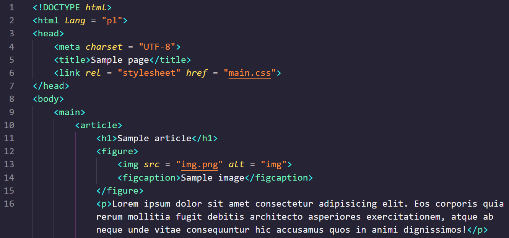

# Witryny internetowe

## HTML

Do opisu strony stosuje się specjalny język - **HTML**, czyli język znaczników hipertekstowych. Serwer **WWW** przesyła do przeglądarki internetowej kod *HTML*. Przeglądarka interpretuje otrzymany kod i wyświetla stronę.

> Plik zapisany w języku *HTML* to plik tekstowy, zapisany z rozszerzeniem *HTML*. Jeden plik opisuje jedną stronę *WWW*. Natomiast *witryna internetowa* składa się z najczęściej w wielu stron, wraz z dodatkowymi danymi, jak obrazy, animacje, czy dźwięki.

Oprócz języka HTML do opisywania wyglądu i funkcjonalności strony wykorzystuje się **CSS** - *kaskadowe arkusze stylów* oraz skryptowy język programowania **JavaScript**.

## Przykładowy kod



Do utworzenia podstawowej witryny wystarczy prosty edytor tekstu. Rozbudowane witryny tworzy się zwykle z wykorzystaniem bardziej specjalistycznych narzędzi. Takie witryny korzystają też często z baz danych.

## Etapy wykonania strony

1. Określenie tematyki strony
2. Planowanie, projektowanie:
    - treści, w tym elementów grafiki, które mają znaleźć się na stronie,
    - rozmieszczenie grafiki względem tekstu,
    - ustalenie kolorystki strony, sposobu formatowania tekstu,
    - systemu nawigacji (odnośników do innych stron lub podstron)
3. Wykonanie strony - stworzenie kodu HTML w oparciu o projekt
4. Sprawdzenie poprawności tekstów i funkcjonowania strony

Na podstawie projektu przygotowuje się szablony poszczególnych podstron, a następnie wypełnia je tekstem. W końcowej fazie sprawdza się poprawność strony, w szczególności na różnych urządzeniach i w różnych przeglądarkach.

## Podstawowy szablon

```html
<!DOCTYPE html>
<html lang = "en">
<head>
    <meta charset = "UTF-8">
    <title>Document</title>
</head>
<body>
    
</body>
</html>
```

Kod HTML opiera się na znacznikach zapisywanych przy pomocy nawiasów ostrych, pomiędzy którymi znajduje się ich nazwa. Część znaczników występuje w parach - otwierający i zamykający. Znacznik zamykający zapisujemy przy użyciu ukośnika.

> Pomiędzy znacznikami można umieszczać kolejne znaczniki lub treść - tekst, który wyświetli się na stronie.

### Nagłówek
```html
<h1>Przykładowy nagłówek</h1>
```

### Akapit
```html
<p>Przykładowy akapit</p>
```

Wszelkie znaczniki odnoszące się do struktury i treści witryny powinny znajdować się pomiędzy znacznikami `<body>`.
